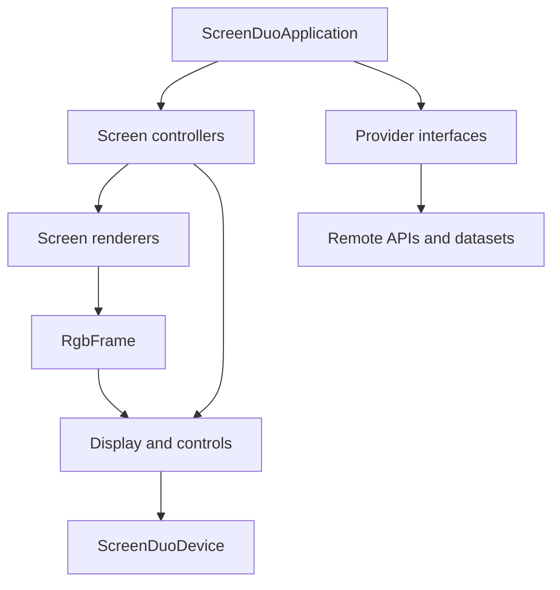
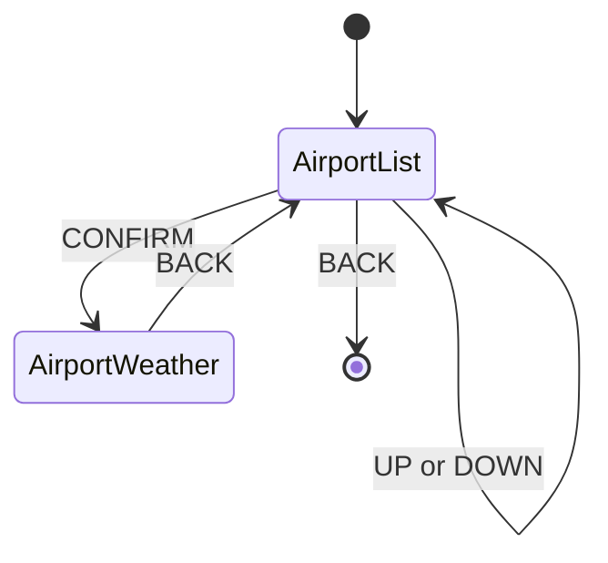

# Architecture

## Goals

ScreenDUO Radar turns a legacy 320x240 USB display into an interactive information dashboard while keeping application features independent from the ASUS hardware.

The architecture is guided by four constraints:

1. renderers and controllers must not depend on usb4java;
2. remote services must sit behind provider interfaces;
3. all screens must render into a common RGB frame;
4. hardware-specific protocol and recovery logic must remain inside the ScreenDUO adapter.

This makes a future display adapter—for example, a digital photo frame, a desktop preview window or a network-connected display—possible without rewriting weather, airport or aircraft features.

## Component overview

## Packages and responsibilities

| Package | Responsibility |
| --- | --- |
| `screenduo` | Application entry point and command selection. |
| `config` | Loads and validates `config.ini`. |
| `display` | Hardware-neutral display contracts, geometry, RGB frames and shared renderers. |
| `device` | ScreenDUO discovery, usb4java access, button mapping and binary protocol. |
| `weather` | Weather domain model and provider contract. |
| `weather.openmeteo` | Open-Meteo adapter. |
| `weather.display` | Weather screen model and renderer. |
| `airport` | Airport domain, provider contract and interactive browser controller. |
| `airport.ourairports` | OurAirports dataset adapter and cache. |
| `airport.display` | Paginated airport-list screen. |
| `aircraft` | Nearby-aircraft domain and provider contract. |
| `aircraft.opensky` | OpenSky adapter. |
| `airline.openflights` | Callsign-prefix-to-airline resolution and cache. |
| `location` | Coordinates, distance and bearing calculations. |
| `data` | Reusable dataset and CSV support. |

## Core abstractions

### Display output

`Display` exposes only:

- `geometry()`, allowing a renderer to target the connected device;
- `show(RgbFrame)`, sending one complete frame;
- `close()`, releasing resources.

`RgbFrame` is the boundary between rendering and hardware. Renderers do not know whether the frame will be sent by USB, displayed in a desktop window or delivered to another device.

### Display input

`DisplayControls` returns hardware-neutral `DisplayButtonEvent` values. The ScreenDUO-specific numeric codes are translated by `ScreenDuoButtonMapper` into `UP`, `DOWN`, `CONFIRM`, `BACK` or `UNKNOWN`.

A future device may implement `Display`, `DisplayControls`, or both.

### Data providers

External data access follows a ports-and-adapters approach:

- `WeatherProvider.currentConditions(GeoPoint)`;
- `AirportProvider.findNearby(GeoPoint, radiusKm)`;
- `AircraftProvider.findNearby(GeoPoint, radiusKm)`.

Controllers and application code depend on these interfaces. Open-Meteo, OurAirports and OpenSky are replaceable adapters rather than application-wide dependencies.

## Rendering

Screen renderers produce complete frames and have no USB dependency. The current visual system:

- uses a native 320x240 logical canvas;
- avoids Swing and JavaFX;
- scales or letterboxes into the target `DisplayGeometry`;
- uses compact, high-contrast typography appropriate for the small LCD;
- keeps data preparation in screen-data records rather than in the hardware adapter.

New screens should follow the same split:

1. domain/provider obtains data;
2. screen-data object selects presentation fields;
3. renderer converts screen data to `RgbFrame`;
4. controller sends the frame through `Display`.

## Airport browser state

`AirportBrowserController` owns the current view and selection. It polls controls every 100 ms and debounces repeated readings of the same button for 600 ms.

Selecting an airport first renders a loading status, then queries weather using the airport coordinates. Returning from weather does not recreate the controller, so `selectedIndex` is preserved.

Network errors render a status screen instead of terminating the browser. Interrupted threads preserve their interruption flag.

## Startup modes

`ScreenDuoApplication` currently exposes:

| Argument | Behavior |
| --- | --- |
| none | Detects the device and prints USB descriptors. |
| `--test-pattern` | Sends a classic television test pattern. |
| `--button-test` | Displays the test pattern and reports button events for 30 seconds. |
| `--weather-screen` | Loads and displays weather for the configured location. |
| `--airport-screen` | Starts the interactive nearby-airport browser. |
| `--api-test` | Queries all current providers and prints diagnostic results without requiring the display. |

## Caching and resilience

OurAirports and OpenFlights are local reference datasets cached under `data/cache/`.

- airport cache lifetime: seven days;
- airline cache lifetime: 30 days;
- a stale cache is used if a refresh fails.

Live weather and aircraft state are queried remotely. Provider exceptions are kept outside the rendering layer.

## Extension guide

### Adding a display

Implement `Display` and convert `RgbFrame` into the device's transport format. If it has physical input, also implement `DisplayControls`. Do not add device checks to renderers or domain classes.

A desktop or file-output adapter is also useful for visual regression tests and development without physical hardware.

### Adding a data source

Implement the relevant provider interface in a source-specific subpackage. Map remote payloads into the existing domain records at the adapter boundary. Keep HTTP details and source-specific field names out of controllers and renderers.

### Adding a screen

Create a screen-data type and renderer, then put navigation and state transitions in a controller. Controllers should depend on provider and display interfaces, not concrete USB or HTTP classes.

## Testing strategy

The automated suite covers protocol encoding/decoding, button mapping, configuration, CSV data, geospatial calculations and screen rendering.

Hardware validation remains mandatory for changes to:

- endpoint transaction order;
- timeouts and block sizes;
- halt clearing or recovery;
- frame pixel order;
- button polling and redraw timing.

The ScreenDUO is stateful and timing-sensitive. A successful unit test cannot prove that a USB transaction sequence works on the physical Windows 11 setup.

## Roadmap

Near-term candidates:

1. interactive nearby-aircraft screen;
2. aircraft detail view with airline, distance, bearing, altitude and speed;
3. scheduled airport arrivals and departures behind a new provider interface;
4. reusable screen navigator instead of controller-specific view enums;
5. desktop/file preview display for development;
6. GraalVM Native Image metadata and packaging;
7. a second physical display adapter to validate hardware independence.
