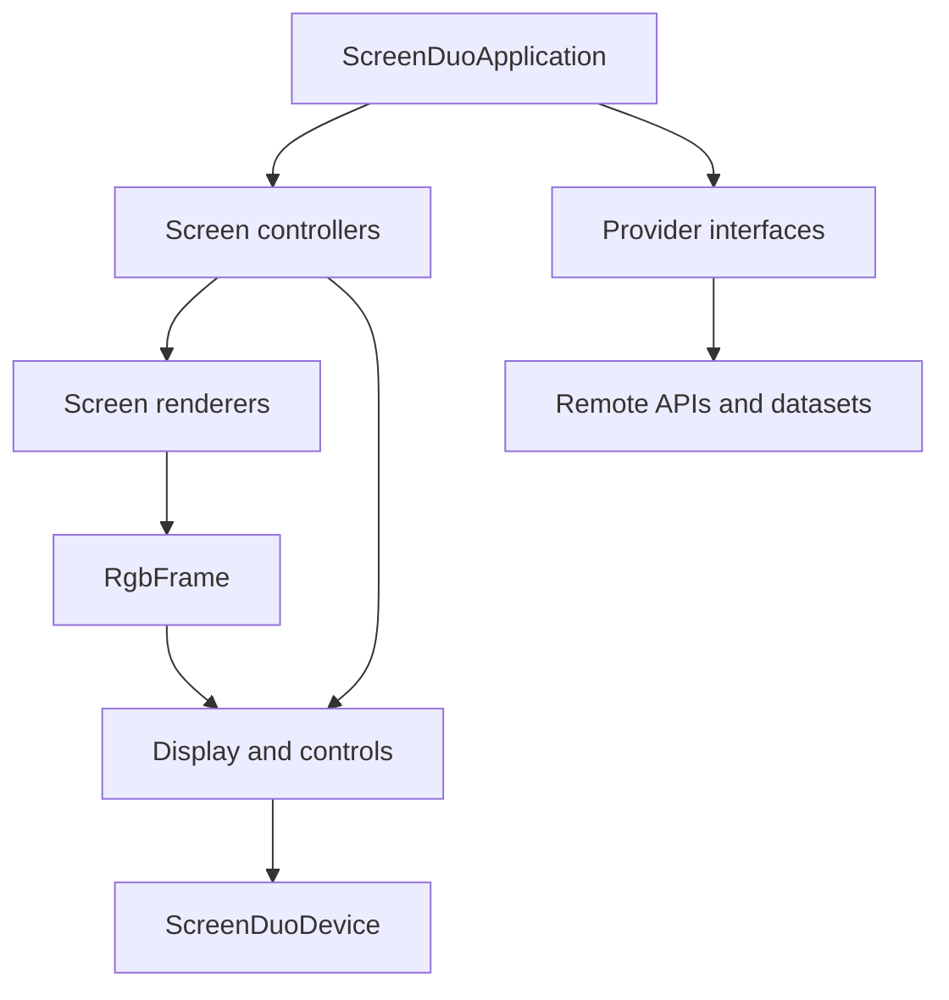
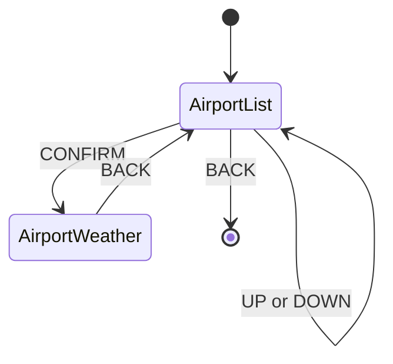
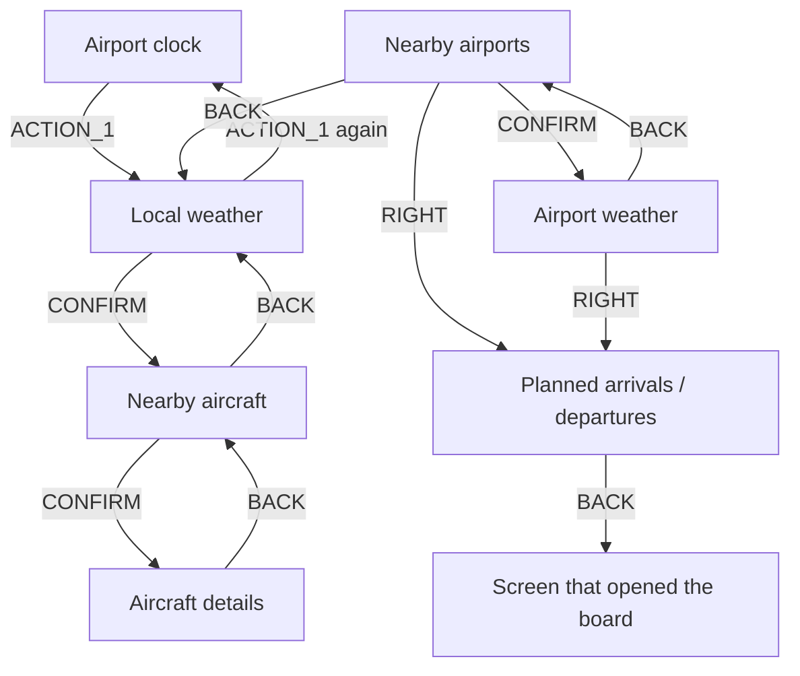

# Architecture

## Goals

ScreenDUO Radar turns a legacy 320x240 USB display into an interactive information dashboard while keeping application features independent from the ASUS hardware.

The architecture is guided by four constraints:

1. renderers and controllers must not depend on usb4java;
2. remote services must sit behind provider interfaces;
3. all screens must render into a common RGB frame;
4. hardware-specific protocol and recovery logic must remain inside the ScreenDUO adapter.

This makes a future display adapter, for example a digital photo frame, a desktop preview window or a network-connected display, possible without rewriting weather, airport or aircraft features.

## Component overview

## Packages and responsibilities

| Package | Responsibility |
| --- | --- |
| `screenduo` | Application entry point and command selection. |
| `config` | Loads and validates `config.ini`. |
| `display` | Hardware-neutral display contracts, geometry, RGB frames and shared renderers. |
| `device` | ScreenDUO discovery, usb4java access, button mapping and binary protocol. |
| `weather` | Weather domain model and provider contract. |
| `weather.openmeteo` | Open-Meteo adapter. |
| `clock.display` | Local weather clock screen model and renderer, including the raster seven-segment digital time. |
| `weather.display` | Weather screen model and renderer. |
| `airport` | Airport domain, provider contract and interactive browser controller. |
| `airport.ourairports` | OurAirports dataset adapter and cache. |
| `airport.display` | Paginated airport-list screen. |
| `aircraft` | Nearby-aircraft domain, provider contract and interactive browser controller. |
| `aircraft.display` | Aircraft list and detail renderers, snapshot/detail data and presentation formatting. |
| `flight` | Planned route and scheduled-flight models, route and airport-schedule provider contracts. |
| `flight.display` | Airport arrival/departure board filtering, ordering and rendering. |
| `navigation` | Integrated dashboard state, global shortcuts and contextual control footer. |
| `flight.siros` | ANAC SIROS schedule adapter and conservative callsign/time matching for Brazilian-territory operations. |
| `aircraft.opensky` | OpenSky adapter. |
| `airline.openflights` | Callsign-prefix-to-airline resolution and cache. |
| `location` | Coordinates, distance and bearing calculations. |
| `data` | Reusable dataset and CSV support. |

## Core abstractions

### Display output

`Display` exposes only:

- `geometry()`, allowing a renderer to target the connected device;
- `show(RgbFrame)`, sending one complete frame;
- `close()`, releasing resources.

`RgbFrame` is the boundary between rendering and hardware. Renderers do not know whether the frame will be sent by USB, displayed in a desktop window or delivered to another device.

### Display input

`DisplayControls` returns hardware-neutral `DisplayButtonEvent` values. The ScreenDUO-specific numeric codes are translated by `ScreenDuoButtonMapper` into `UP`, `DOWN`, `CONFIRM`, `BACK` or `UNKNOWN`.

A future device may implement `Display`, `DisplayControls`, or both.

### Data providers

External data access follows a ports-and-adapters approach:

- `WeatherProvider.currentConditions(GeoPoint)`;
- `AirportProvider.findNearby(GeoPoint, radiusKm)`;
- `AircraftProvider.findNearby(GeoPoint, radiusKm)`;
- `FlightRouteProvider.findRoute(callsign, referenceTime)`;
- `AirportFlightProvider.findFlights(airportIcao, utcDate)`.

Controllers and application code depend on these interfaces. Open-Meteo, OurAirports and OpenSky are replaceable adapters rather than application-wide dependencies. OurAirports also supplies optional city labels for scheduled routes.

## Rendering

Screen renderers produce complete frames and have no USB dependency. The current visual system:

- uses a native 320x240 logical canvas;
- avoids Swing and JavaFX;
- scales or letterboxes into the target `DisplayGeometry`;
- uses compact, high-contrast typography appropriate for the small LCD;
- keeps data preparation in screen-data records rather than in the hardware adapter;

New screens should follow the same split:

1. domain/provider obtains data;
2. screen-data object selects presentation fields;
3. renderer converts screen data to `RgbFrame`;
4. controller sends the frame through `Display`.

The clock renderer draws the digital time with an internal raster seven-segment renderer. Other clock elements keep the same visual language as the local weather screen, with a smaller weather summary and a day/night-aware icon driven by Open-Meteo data. Avoiding AWT/Java2D in the clock path keeps Native Image startup small and predictable.

## Airport browser state

`AirportBrowserController` owns the current view and selection. It polls controls every 100 ms and debounces repeated readings of the same button for 600 ms.

Selecting an airport first renders a loading status, then queries weather using the airport coordinates. Returning from weather does not recreate the controller, so `selectedIndex` is preserved.

Network errors render a status screen instead of terminating the browser. Interrupted threads preserve their interruption flag.

## Aircraft browser state

`AircraftBrowserController` depends on `Display`, `DisplayControls`, `AircraftProvider` and `FlightRouteProvider`. The application supplies the configured reference location and aircraft radius. A query on entry produces a distance-sorted snapshot shared by the four-row list and detail view.

`UP`/`DOWN` wrap the selection. `CONFIRM` opens details, resolving a planned route on the first lookup for that callsign. `BACK` restores the list and selection; from the list it exits. Empty lists ignore selection actions. Query failures show an error screen with explicit retry (`CONFIRM`) and exit (`BACK`) actions. Interrupted queries propagate to the application entry point.

Polling and rendering remain serial, using the existing 100 ms polling interval and 600 ms same-button debounce convention. There are no background USB calls or changes to endpoint synchronization. Renderers produce RGB frames and scale/letterbox for other display geometries.

Aircraft screens can include optional airline logos stored as data/cache/airline-logos/ICAO.rgb. On cache miss, the logo provider maps ICAO callsign prefixes to IATA through OpenFlights, reads logo URLs from dotmarn/Airlines, decodes PNG bytes with an internal reader and writes a fixed-size raw RGB cache entry. It avoids AWT and ImageIO so the feature remains compatible with the Native Image direction. Missing, invalid or unreachable logo files are ignored and the existing text layout remains usable. The snapshot label records query completion in UTC. It is not an observation timestamp and does not imply live updates. Periodic refresh is deferred. Automated tests use a fake display, scripted controls, a controllable clock and stub providers; they do not access USB or remote services.

### Planned route enrichment

`SirosFlightRouteProvider` reads the public `voosPeriodo` endpoint. SIROS supplies ICAO route codes; the application enriches those routes with city names from OurAirports when the airport ident is present there. It accepts both an array and the JSON-string-wrapped array currently returned by SIROS. It parses UTC schedule timestamps strictly, skips incomplete records and returns a route only for a unique operating-airline/numeric-flight match within the scheduled interval plus two hours on each side. Exact duplicate routes/times are collapsed; ambiguous stages remain unresolved. Codeshares and alphanumeric callsigns are not used to infer an operating flight.

The provider queries the snapshot's UTC date plus the preceding and following dates. It uses `CachedHttpFile` with an explicit JSON Accept header and six-hour disk freshness; existing CSV consumers retain their original header. The parsed schedule is held for the reference date during the browser session. Existing stale files may be used after download failure, so the UI always labels the result as planned.

SIROS coverage is limited to registrations for operations involving Brazilian territory, including international operations represented there. It is neither worldwide flight coverage nor guaranteed coverage of every aircraft over Brazil. It does not establish actual takeoff, landing, cancellation or diversion. See the README's SIROS section for user-facing limitations.

`AircraftDetailScreenData` keeps optional route information separate from OpenSky's `NearbyAircraft`. The controller caches successful, empty and failed lookups per callsign for the snapshot. An I/O failure renders normal aircraft details with an unavailable route, while interruption propagates. Route lookup and rendering are serial and do not modify USB endpoint logic.

## Integrated dashboard navigation

`RadarDashboardController` implements the `--dashboard` mode. It owns one polling loop and all integrated screen state, reusing the existing weather, aircraft and airport renderers. Standalone controllers remain entry points for the legacy modes. There are no nested controller loops and no concurrent USB reads or writes.

The dashboard opens on the local weather clock using the local system time zone. `ACTION_1` opens local weather, a second sequential `ACTION_1` returns to the clock, and `ACTION_2` opens nearby airports before view-specific dispatch, including on error screens. These reuse the existing native mappings (12 and 13). The controller maintains the existing 100 ms polling interval and 600 ms same-button debounce, including across view transitions.

Global button 1 and button 2 are available in every state. `BACK` from the clock exits, and `BACK` from local weather returns to the clock. I/O errors offer retry and parent navigation; route lookup failures leave aircraft details usable. Interrupted operations propagate to the entry point.

`SirosFlightRouteProvider` also implements `AirportFlightProvider`, sharing its parsed schedule and disk cache with route lookups. The airport query filters by the event at the selected airport and its UTC calendar date: a previous-day departure can therefore appear in today's arrivals. `AirportFlightBoardData` filters the tab, deduplicates and sorts by scheduled event time. It never presents scheduled events as confirmed operations. SIROS's Brazilian-territory coverage limitations apply equally to these boards.

Each snapshot is retained during the dashboard session. The board is refreshed on opening another airport or UTC date; tab selections are preserved while that board remains loaded. The contextual footer is applied on the 320x240 logical frame before scaling/letterboxing, keeping navigation independent of display geometry.

Tests exercise complete screen sequences, global shortcuts from nested/error views, selection preservation, empty lists, query failures/retry, shared debounce, midnight schedule filtering and alternate display geometry. Full button navigation still requires physical ScreenDUO validation.

## Startup modes

`ScreenDuoApplication` currently exposes:

| Argument | Behavior |
| --- | --- |
| none | Detects the device and prints USB descriptors. |
| `--test-pattern` | Sends a classic television test pattern. |
| `--button-test` | Displays the test pattern and reports button events for 30 seconds. |
| `--dashboard` | Starts the integrated weather, aircraft, airport and scheduled-flight dashboard. |
| `--weather-screen` | Loads and displays weather for the configured location. |
| `--airport-screen` | Starts the interactive nearby-airport browser. |
| `--aircraft-screen` | Starts the interactive nearby-aircraft list and detail browser. |
| `--api-test` | Queries all current providers and prints diagnostic results without requiring the display. |

## Caching and resilience

OurAirports, OpenFlights and SIROS schedules are cached under `data/cache/`.

- airport cache lifetime: seven days;
- airline cache lifetime: 30 days;
- SIROS schedule file freshness: six hours, with files keyed by reference UTC date;
- a stale cache is used if a refresh fails.

Live weather and aircraft state are queried remotely. Provider exceptions are kept outside the rendering layer.

## Extension guide

### Adding a display

Implement `Display` and convert `RgbFrame` into the device's transport format. If it has physical input, also implement `DisplayControls`. Do not add device checks to renderers or domain classes.

A desktop or file-output adapter is also useful for visual regression tests and development without physical hardware.

### Adding a data source

Implement the relevant provider interface in a source-specific subpackage. Map remote payloads into the existing domain records at the adapter boundary. Keep HTTP details and source-specific field names out of controllers and renderers.

### Adding a screen

Create a screen-data type and renderer, then put navigation and state transitions in a controller. Controllers should depend on provider and display interfaces, not concrete USB or HTTP classes.

## Testing strategy

The automated suite covers protocol encoding/decoding, button mapping, configuration, CSV data, geospatial calculations, screen rendering, aircraft navigation, SIROS matching and HTTP cache fallback.

Hardware validation remains mandatory for changes to:

- endpoint transaction order;
- timeouts and block sizes;
- halt clearing or recovery;
- frame pixel order;
- button polling and redraw timing.

The ScreenDUO is stateful and timing-sensitive. A successful unit test cannot prove that a USB transaction sequence works on the physical Windows 11 setup.

## Roadmap

Near-term candidates:

1. publish Windows Native Image packages through GitHub Releases;
2. publish Linux and Raspberry Pi builds;
3. aircraft snapshot refresh with selection preservation;
4. refresh controls for the integrated dashboard snapshots;
5. desktop/file preview display for development;
6. a Raspberry Pi plus small HDMI display adapter to validate hardware independence;
7. evaluate e-paper and other frame-style displays for slower dashboard modes;
8. consolidate standalone controllers with integrated navigation when their behavior is aligned.
