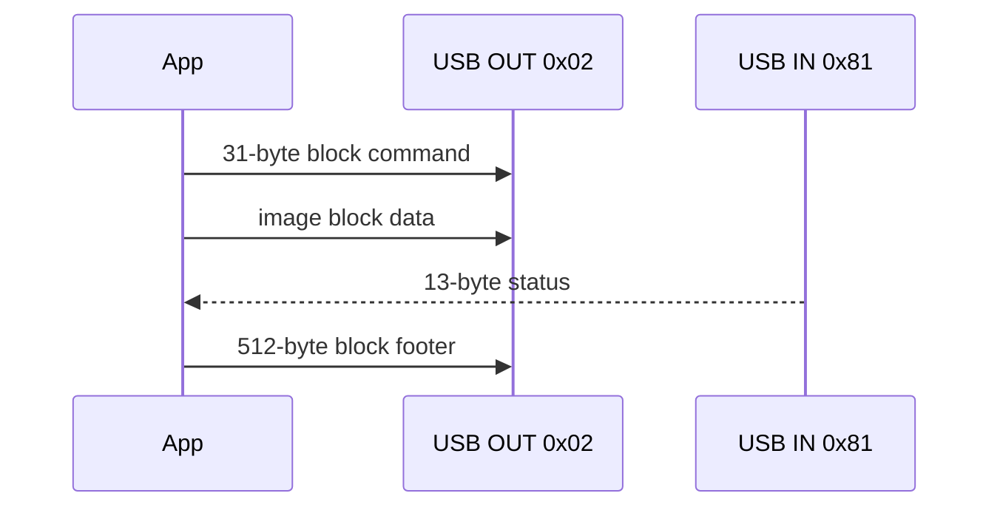

# ScreenDUO USB Protocol

## Scope and warning

This document records the behavior implemented and tested with the ASUS ScreenDUO identified as USB `1043:3100` on Windows 11.

The protocol is undocumented by ASUS. The implementation was derived from observed device traffic and the open-source [screenduo-userspace](https://github.com/TheMorc/screenduo-userspace) project, then validated on the physical device. Treat every change to transaction order as a hardware experiment.

The current implementation is isolated in:

- `ScreenDuoDevice`: lifecycle, transfers, synchronization and recovery;
- `ScreenDuoProtocol`: binary encoding and decoding;
- `ScreenDuoButtonMapper`: device codes to application buttons.

## USB descriptors

The tested device reports:

| Field | Value |
| --- | --- |
| Vendor ID | `0x1043` |
| Product ID | `0x3100` |
| USB version | 2.00 |
| Interface | 0, alternate setting 0 |
| Interface class | vendor-specific `0xff` |
| Bulk IN endpoint | `0x81`, maximum packet 512 bytes |
| Bulk OUT endpoint | `0x02`, maximum packet 512 bytes |
| Native geometry | 320x240 pixels |

The application claims interface 0 and clears both endpoint halts when opening the device.

## Image format

The ScreenDUO accepts a complete 320x240 RGB frame preceded by a 32-byte image header. `ScreenDuoProtocol.encodeFrame` rejects any other geometry.

The encoded image is divided into blocks of at most `0x10000` bytes. Each block uses this logical sequence:



Commands use the `USBC` signature represented as little-endian integer `0x43425355`. Image transfers use tag `0x843d84a0` and command `0x02e6`. Multi-byte fields intentionally mix little- and network-byte order according to the observed protocol; do not normalize them without hardware evidence.

## Button polling

Button polling uses tag `0xe6abb010`, command `0x03e7` and requests a 256-byte response.

A button-state packet begins with:

```text
03 00 08 00 <declared-length> 00 00 00
```

When `declared-length` is greater than eight, the final byte contains the current device button code. Empty eight-byte packets represent no actionable button event. Codes are converted to hardware-neutral events by `ScreenDuoButtonMapper`.

Physical presses may generate repeated packets. Application controllers must debounce them; the airport browser currently uses 600 ms.

## Critical transaction order

Button reads can leave more than one packet or a status-like response waiting on endpoint `0x81`. Starting an image redraw before completing the button transaction caused a reproducible failure:

```text
USB error 9: Unable to read ScreenDUO block status: Pipe error
```

The sequence validated on the physical device is:

1. write the button-poll command to OUT `0x02`;
2. read the initial response from IN `0x81`;
3. repeatedly read and preserve pending packets until the endpoint returns no data;
4. clear the halt on IN `0x81`;
5. perform the final cleanup read;
6. only then allow the next image transaction.

This drain-then-clear order follows the behavior of the original userspace driver. Reversing it or performing only one drain read can desynchronize the following image status response.

## Synchronization before redraw

Before every image transfer, `ScreenDuoDevice` performs defensive synchronization:

1. drain a bounded number of stale IN packets using short timeouts;
2. clear the halt on IN `0x81`;
3. clear the halt on OUT `0x02`;
4. begin the image block sequence.

The drain loops are bounded so a malfunctioning device cannot block the application indefinitely.

The first status read after a block also has a single recovery path: when libusb reports `ERROR_PIPE` without returning data, the implementation clears the IN halt and retries once. It does not retry an entire image indefinitely.

## Partial reads and libusb statuses

libusb may report a timeout after transferring useful bytes. `readUsb` therefore preserves and returns transferred bytes even when the status is a timeout. A complete 13-byte image status is accepted.

Expected no-data conditions during bounded drain operations include timeout and pipe status. Other libusb failures are propagated.

This behavior is deliberate. Replacing it with a generic “status must always be success” check can discard valid partial responses and destabilize the transaction.

## Timeouts and limits

The current values are implementation details chosen from successful hardware tests:

| Operation | Timeout/limit |
| --- | --- |
| Command write | 1,000 ms |
| Image data write | 5,000 ms |
| Image status read | 2,000 ms |
| Initial button read | 500 ms |
| Button drain/final read | 100 ms |
| Pre-image synchronization read | 25 ms |
| Maximum button drain reads | 8 |
| Maximum pre-image drain reads | 8 |

Do not increase timeouts as the first response to a pipe error. A pipe error usually indicates endpoint state or transaction ordering, not a slow transfer.

## Diagnostic commands

Detect the device and inspect descriptors:

```powershell
mvn exec:java
```

Send a known frame:

```powershell
mvn exec:java "-Dexec.args=--test-pattern"
```

Probe buttons for 30 seconds:

```powershell
mvn exec:java "-Dexec.args=--button-test"
```

For navigation/redraw validation:

```powershell
mvn exec:java "-Dexec.args=--airport-screen"
```

Exercise repeated `UP`/`DOWN` redraws, then `CONFIRM` and `BACK`. This is the shortest end-to-end test of button input, endpoint cleanup, network loading, rendering and image output.

## Known operational behavior

- A failed or interrupted experiment may leave the ScreenDUO in a stalled state.
- Power cycling may reset the device, but it does not fix an incorrect transaction order.
- Only one process should claim the USB interface.
- The current hardware path has been validated on Windows 11, not on the original Windows Vista software stack.
- Remote environments and CI cannot access the user's physical ScreenDUO.

When reporting a failure, capture the full descriptor report, command used, the first libusb error, and whether the last successful action was a button read or image redraw.

## Change checklist

Before accepting a protocol change:

- run `mvn test`;
- run `--test-pattern`;
- run `--button-test`;
- run `--airport-screen`;
- press each physical button;
- perform several consecutive list redraws;
- confirm airport weather and return with `BACK`;
- verify that no timeout or pipe error occurs.

Document newly observed packets before changing constants or decoding rules.
